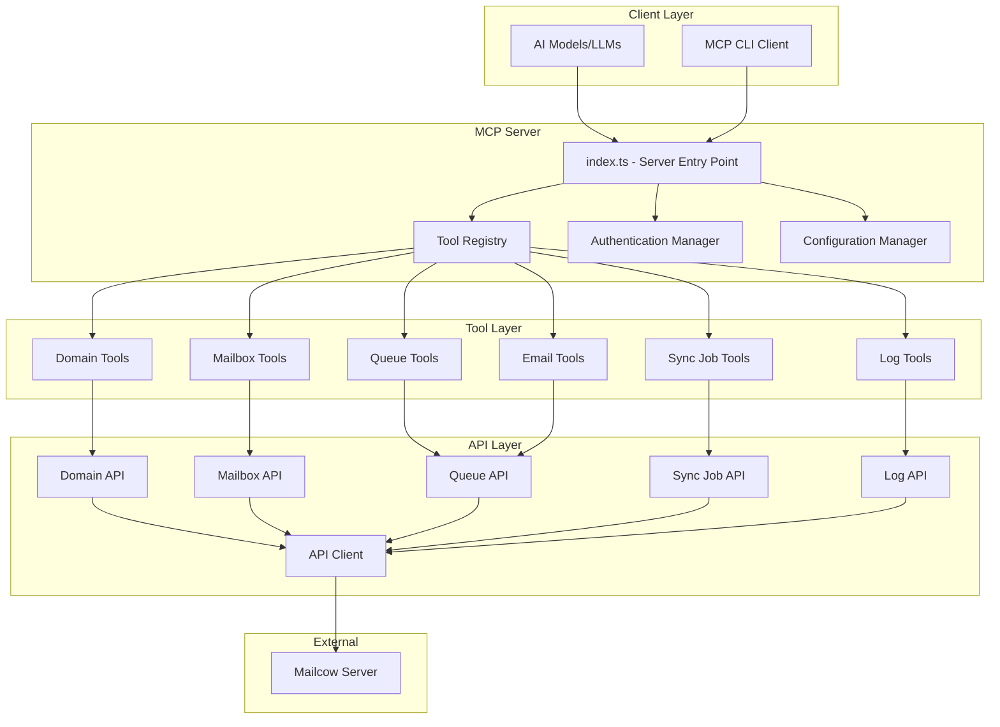

# 🏗️ Architecture Overview

This document describes the architecture of the Mailcow MCP Server, a TypeScript implementation that provides Model Context Protocol access to Mailcow email servers.

## 📐 System Architecture



## 🗂️ Directory Structure

```
src/
├── index.ts                    # MCP Server entry point
├── config/                     # Configuration management
│   ├── index.ts               # Config exports
│   ├── config.ts              # Config manager
│   ├── defaults.ts            # Default settings
│   ├── environment.ts         # Environment variables
│   └── validation.ts          # Config validation
├── auth/                       # Authentication & security
│   ├── index.ts               # Auth exports
│   ├── auth.ts                # Main auth manager
│   ├── api-key.ts             # API key management
│   ├── session.ts             # Session management
│   └── security.ts            # Security utilities
├── api/                        # Mailcow API clients
│   ├── client.ts              # HTTP client
│   ├── endpoints.ts           # API endpoint definitions
│   ├── domains/               # Domain API
│   ├── mailboxes/             # Mailbox API
│   ├── queues/                # Queue API
│   ├── syncjobs/              # Sync job API
│   ├── logs/                  # Log API
│   └── [other APIs...]
├── tools/                      # MCP tool implementations
│   ├── base.ts                # Base tool class
│   ├── registry.ts            # Tool registry
│   ├── domains/               # Domain management tools
│   ├── mailboxes/             # Mailbox management tools
│   ├── queues/                # Queue management tools
│   ├── jobs/                  # Sync job tools
│   ├── logs/                  # Log management tools
│   └── email/                 # Email tools
├── types/                      # TypeScript definitions
│   ├── api.ts                 # API types
│   ├── auth.ts                # Auth types
│   ├── config.ts              # Config types
│   ├── mailcow.ts             # Mailcow entity types
│   ├── mcp.ts                 # MCP protocol types
│   └── tools.ts               # Tool types
└── utils/                      # Utility functions
    ├── logger.ts              # Logging utilities
    ├── http.ts                # HTTP utilities
    ├── validation.ts          # Validation helpers
    ├── security.ts            # Security utilities
    └── [other utils...]
```

## 🔧 Core Components

### 1. MCP Server Entry Point (`src/index.ts`)

The main server implementation that:
- Initializes the MCP protocol server
- Manages tool and resource registration
- Handles JSON-RPC 2.0 communication
- Provides server lifecycle management

**Key Features:**
- Standards-compliant MCP protocol implementation
- Automatic tool discovery and registration  
- Comprehensive error handling and logging
- Graceful shutdown handling

### 2. Tool Registry (`src/tools/registry.ts`)

Central registry for all MCP tools with:
- Dynamic tool registration and discovery
- Input validation and schema enforcement
- Permission-based access control
- Tool execution lifecycle management

### 3. API Client Layer (`src/api/`)

HTTP client infrastructure for Mailcow API communication:
- **Base Client**: Authentication, rate limiting, error handling
- **Specialized APIs**: Domain-specific API implementations
- **Type Safety**: Full TypeScript coverage for all API operations

### 4. Authentication System (`src/auth/`)

Comprehensive authentication and security:
- API key validation and management
- Permission-based access control
- Session management with automatic refresh
- Security audit logging

### 5. Configuration Management (`src/config/`)

Environment-based configuration system:
- Environment variable processing
- Configuration validation and defaults
- Multi-environment support (dev, staging, prod)
- Runtime configuration updates

## 🛠️ Tool Architecture

### Base Tool Pattern

All tools extend the `BaseTool` class providing:

```typescript
abstract class BaseTool {
  abstract name: string;
  abstract description: string;  
  abstract inputSchema: ToolSchema;
  abstract execute(input: ToolInput, context: ToolContext): Promise<ToolHandlerResult>;
  
  // Shared functionality:
  protected validateInput(input: ToolInput): ValidationResult;
  protected validatePermissions(context: ToolContext, required: string[]): boolean;
  protected logExecution(input: ToolInput, context: ToolContext): void;
  protected handleError(error: Error, context: ToolContext): ToolHandlerResult;
}
```

### Tool Categories

| Category | Tools | Purpose |
|----------|-------|---------|
| **System** | 3 tools | Health checks, configuration, API testing |
| **Domains** | 5 tools | Domain lifecycle management |
| **Mailboxes** | 5 tools | Email account management |
| **Queues** | 6 tools | Mail queue operations |
| **Sync Jobs** | 7 tools | Email migration and sync |  
| **Logs** | 4 tools | System monitoring and troubleshooting |
| **Email** | 3 tools | Email composition and sending |

## 🔌 API Integration

### Mailcow API Patterns

Mailcow uses action-based (non-RESTful) API patterns:

```typescript
// ✅ Correct Mailcow patterns
const domains = await client.get('/api/v1/get/domain');
const result = await client.post('/api/v1/add/domain', domainData);
await client.post('/api/v1/edit/domain', updateData);  
await client.post('/api/v1/delete/domain', { items: [domain] });

// ❌ Wrong - RESTful patterns don't work
const domains = await client.get('/api/v1/domains');  // Won't work
await client.put('/api/v1/domains/example.com', data); // Won't work
```

### Authentication

API authentication uses X-API-Key headers:

```typescript  
const config = {
  headers: {
    'X-API-Key': process.env.MAILCOW_API_KEY,
    'Content-Type': 'application/json'
  }
};
```

## 📊 Data Flow

### Tool Execution Flow

1. **Client Request**: AI model calls MCP tool via JSON-RPC
2. **Tool Registry**: Validates tool name and permissions  
3. **Input Validation**: Validates input against JSON schema
4. **Permission Check**: Verifies user has required permissions
5. **API Client**: Makes authenticated request to Mailcow
6. **Response Processing**: Transforms API response for MCP format
7. **Result Return**: Returns formatted result to client

### Error Handling Flow

1. **Error Capture**: All errors caught at tool level
2. **Error Classification**: Categorize error type (auth, network, validation, etc.)
3. **Error Logging**: Log error with context for debugging
4. **Error Transformation**: Convert to appropriate MCP error code
5. **Error Response**: Return user-friendly error message

## 🔒 Security Architecture  

### Authentication Layers

1. **API Key Validation**: Mailcow API key validation
2. **Permission Checking**: Tool-level permission enforcement  
3. **Input Sanitization**: All inputs validated and sanitized
4. **Audit Logging**: All operations logged for security audit

### Security Controls

- **HTTPS Enforcement**: All API communication over HTTPS
- **Rate Limiting**: Request throttling to prevent abuse
- **Input Validation**: JSON schema validation for all inputs
- **Permission Model**: Granular permission system  
- **Session Management**: Secure session handling with refresh

## 🚀 Performance Characteristics

### Optimizations

- **Connection Pooling**: Reuse HTTP connections to Mailcow
- **Request Batching**: Batch multiple operations where possible
- **Response Caching**: Cache static data (configurations, schemas)
- **Lazy Loading**: Load tools and resources on demand

### Scalability

- **Stateless Design**: Server can be horizontally scaled
- **Resource Isolation**: Each tool operates independently  
- **Graceful Degradation**: System continues with partial failures
- **Health Monitoring**: Built-in health checks and metrics

## 🔧 Extension Points

### Adding New Tools

1. Create tool class extending `BaseTool`
2. Implement required abstract methods
3. Add tool to appropriate tool collection
4. Register tool in server initialization
5. Add tests and documentation

### Adding New APIs  

1. Create API class in `src/api/[name]/`
2. Implement API methods with proper typing
3. Add API endpoints to endpoints configuration
4. Create corresponding tools that use the API
5. Add integration tests

## 📈 Monitoring & Observability

### Logging

- **Structured Logging**: JSON-formatted logs with context
- **Log Levels**: DEBUG, INFO, WARN, ERROR with appropriate filtering
- **Request Tracing**: Track requests through the entire stack
- **Performance Metrics**: Response times and error rates

### Health Checks

- **Server Health**: Basic server responsiveness
- **API Connectivity**: Mailcow API reachability and authentication  
- **Tool Availability**: Individual tool health status
- **Resource Usage**: Memory and CPU utilization monitoring

This architecture provides a robust, scalable, and maintainable foundation for MCP-based Mailcow management with clear separation of concerns and comprehensive error handling.